# Máquina Vulnerable Backend

> **Plataforma:** DockerLabs  
> **Dificultad:** Fácil   
> **Sistema operativo:** Linux
## Herramientas utilizadas

* Nmap
* Burp Suite
* SQLMap
* Hydra
* John the Ripper
* hash-identifier

## Vulnerabilidades explotadas

* SQL Injection
* Ataque de fuerza bruta contra SSH
* Escalada de privilegios mediante binario ejecutable `su`

---

# 1. Escaneo inicial

Como primera instancia, y como de costumbre, se realiza un escaneo de puertos y servicios utilizando **Nmap**.

```bash
nmap -p- -sS -sV -sC -T5 -n -Pn -vvv 172.17.0.2
```

El escaneo muestra que existen dos puertos de interés:

| Puerto | Servicio |
| ------ | -------- |
| `22`   | SSH      |
| `80`   | HTTP     |

El puerto `80` corresponde a una página web, por lo que se procede a acceder al servicio para analizar la aplicación.

> **Captura del escaneo de Nmap**
>
> 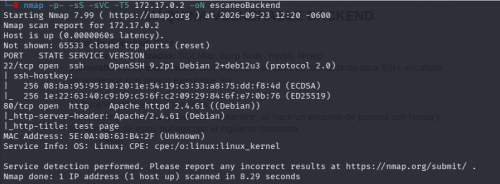

---

# 2. Enumeración de la aplicación web

Al acceder al puerto `80` se encuentra una página web sencilla.

Dentro de la aplicación existe un apartado de **login**.

La página no presenta una opción para registrarse, por lo que se decide analizar el formulario para comprobar si puede ser vulnerable a **SQL Injection**.

Como primera prueba se utiliza:

```text
Username: admin
Password: 'OR' 1'='1'-- -
```

La aplicación responde indicando que las credenciales son incorrectas.

> **Captura del formulario**
>
> 

---

# 3. Identificación de SQL Injection

Como siguiente prueba, se introduce una comilla simple (`'`) en el campo de usuario y cualquier valor en la contraseña.

La aplicación devuelve un **error de sintaxis**.

Este comportamiento resulta interesante, ya que puede indicar que la entrada proporcionada por el usuario está llegando a una consulta SQL.

Por este motivo, se decide utilizar **Burp Suite** para analizar la petición HTTP.

---

# 4. Captura de la petición con Burp Suite

Se utiliza **Burp Suite** para interceptar y analizar la petición realizada por el formulario de login.

Una vez capturada la petición, se guarda el resultado en un archivo de texto para posteriormente utilizarlo con **SQLMap**.

> 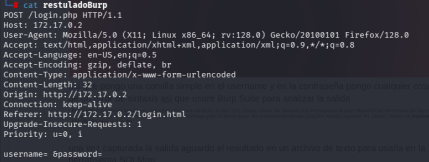

---

# 5. Explotación mediante SQLMap

Una vez guardada la petición de Burp Suite, se utiliza **SQLMap** para comprobar si es posible obtener información de la base de datos.

```bash
sqlmap -r resultadoBurp --dbs --batch
```

El resultado confirma que la aplicación es vulnerable a **SQL Injection**.

Además, SQLMap permite enumerar las bases de datos disponibles.

> **Captura del resultado de SQLMap**
>
> 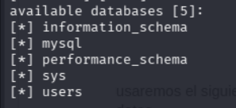

---

# 6. Enumeración de tablas

Después de identificar la base de datos de interés, se procede a enumerar las tablas.

```bash
sqlmap -r resultadoBurp -D users --tables --batch
```

El resultado permite identificar las tablas existentes dentro de la base de datos.

> **Captura de las tablas**
>
> 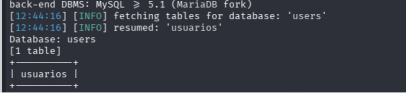

---

# 7. Extracción de información de la tabla `usuarios`

Una vez identificada la tabla `usuarios`, se utiliza `--dump` para obtener su contenido.

```bash
sqlmap -r resultadoBurp -D users -T usuarios --batch --dump
```

El resultado muestra la información almacenada en la tabla.

> **Captura del contenido de la tabla**
>
> 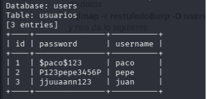

---

# 8. Obtención de credenciales

A partir de la información obtenida de la base de datos, se decide crear dos archivos `.txt`:

* Uno con posibles nombres de usuario.
* Otro con posibles contraseñas.

Estos archivos serán utilizados posteriormente con **Hydra** para comprobar si alguna de las credenciales permite acceder al servicio SSH.

---

# 9. Ataque contra SSH utilizando Hydra

Se utiliza Hydra con el siguiente comando:

```bash
hydra -L username -P password ssh://172.17.0.2
```

El ataque permite encontrar unas credenciales válidas.

> **Captura del resultado de Hydra**
>
> 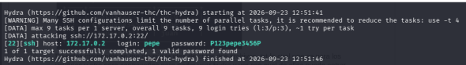

Con las credenciales obtenidas es posible conectarse al servidor mediante SSH.

El usuario obtenido es:

```text
pepe
```

---

# 10. Acceso mediante SSH

Con las credenciales encontradas se realiza una conexión SSH al servidor.

Una vez dentro de la máquina, se obtiene acceso como el usuario:

```text
pepe
```
>**Usuario pepe**
>
>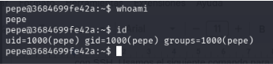

A partir de este momento comienza la fase de **enumeración local**, cuyo objetivo es encontrar una posible forma de escalar privilegios.

---

# 11. Enumeración de binarios SUID

Se realiza una búsqueda de archivos que tengan establecido el permiso **SUID**.

```bash
find / -perm -4000 -ls 2>/dev/null
```

El resultado muestra diferentes binarios ejecutables.

Entre ellos se identifica `su`.

> **Captura de los binarios SUID**
>
> 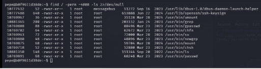

---

# 12. Búsqueda del archivo `pass.hash`

Durante la enumeración se realiza:

```bash
ls /root
```

Se observa un archivo llamado:

```text
pass.hash
```

Posteriormente se utiliza `grep` para leer su contenido.

El resultado obtenido es:

```text
e43833c4c9d5ac444e16bb94715a75e4
```

> **Captura del hash**
>
> 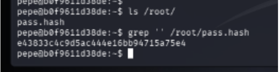

---

# 13. Identificación del tipo de hash

Para identificar el algoritmo utilizado se utiliza **hash-identifier**.

El resultado indica que el hash corresponde a:

```text
MD5
```

> **Captura de hash-identifier**
>
> 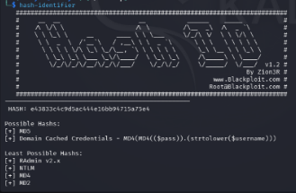

---

# 14. Recuperación del hash con John the Ripper

Una vez identificado el tipo de hash se copiara el hash y se pondra como sobre nombre **root.txt** y se utiliza **John the Ripper** junto con el diccionario `rockyou`.

> **Captura escribiendo el hash y pasandolo con el sobre nombre root.txt**
>
> 

```bash
john --format=Raw-MD5 --wordlist=ruta/del/diccionario hash
```

> **Captura de John the Ripper**
>
> 

El resultado permite recuperar la contraseña:

```text
spongebob34
```

>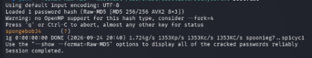
---

# 15. Escalada de privilegios

Una vez obtenida la contraseña, se utiliza `su` para cambiar al usuario `root`.

```bash
su
```

Se introduce la contraseña recuperada:

```text
spongebob34
```

Finalmente se obtiene acceso como:

```text
root
```

> **Captura del acceso como root**
>
> 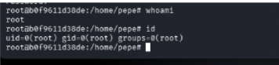

Con esto se completa la explotación de la máquina.

---

# 16. Cadena de explotación

```text
Nmap
  │
  ▼
Puerto 80 / Aplicación web
  │
  ▼
Formulario de Login
  │
  ▼
SQL Injection
  │
  ▼
Burp Suite
  │
  ▼
SQLMap
  │
  ▼
Base de datos
  │
  ▼
Tabla usuarios
  │
  ▼
Credenciales
  │
  ▼
Hydra
  │
  ▼
SSH
  │
  ▼
Usuario pepe
  │
  ▼
Enumeración SUID
  │
  ▼
pass.hash
  │
  ▼
MD5
  │
  ▼
John the Ripper
  │
  ▼
spongebob34
  │
  ▼
su
  │
  ▼
ROOT
```

---

# 17. Herramientas utilizadas

| Herramienta         | Utilización                                      |
| ------------------- | ------------------------------------------------ |
| **Nmap**            | Escaneo de puertos y servicios                   |
| **Burp Suite**      | Captura y análisis de peticiones HTTP            |
| **SQLMap**          | Explotación y enumeración mediante SQL Injection |
| **Hydra**           | Ataque de diccionario contra SSH                 |
| **find**            | Búsqueda de archivos con permisos SUID           |
| **hash-identifier** | Identificación del tipo de hash                  |
| **John the Ripper** | Recuperación de la contraseña a partir del hash  |
| **su**              | Cambio al usuario `root`                         |

---

# 18. Vulnerabilidades y técnicas utilizadas

## SQL Injection

La aplicación web permitió introducir datos que podían afectar el comportamiento de una consulta SQL.

```text
SQL Injection
      ↓
Enumeración de bases de datos
      ↓
Enumeración de tablas
      ↓
Extracción de información
```

## Ataque de diccionario contra SSH

Las credenciales obtenidas durante la explotación de la aplicación web fueron utilizadas para generar listas de usuarios y contraseñas.

Posteriormente se utilizó Hydra para probar estas combinaciones contra SSH.

## Escalada de privilegios

Después de obtener acceso como `pepe`, se realizó una enumeración de binarios SUID.

También se encontró un archivo `pass.hash` que contenía un hash MD5.

El hash fue recuperado mediante John the Ripper y la contraseña obtenida permitió utilizar `su` para acceder como `root`.

---

# 19. Lo aprendido

Esta máquina permitió practicar diferentes fases de una explotación:

* Enumeración de puertos y servicios.
* Identificación de una aplicación web.
* Identificación de una posible SQL Injection.
* Uso de Burp Suite para capturar peticiones HTTP.
* Uso de SQLMap.
* Enumeración de bases de datos.
* Enumeración de tablas.
* Extracción de información.
* Reutilización de credenciales.
* Ataques de diccionario con Hydra.
* Acceso mediante SSH.
* Enumeración de binarios SUID.
* Identificación de hashes.
* Uso de John the Ripper.
* Escalada de privilegios mediante `su`.

---

# 20. Resumen

La explotación comenzó con la enumeración de servicios mediante Nmap.

Después se identificó una aplicación web con un formulario de login. Las pruebas realizadas indicaron una posible SQL Injection, por lo que se utilizó Burp Suite para capturar la petición y posteriormente SQLMap para explotar la vulnerabilidad.

SQLMap permitió enumerar la base de datos y extraer información de la tabla `usuarios`.

Las credenciales obtenidas fueron utilizadas para realizar un ataque contra SSH mediante Hydra, consiguiendo acceso como el usuario `pepe`.

Una vez dentro del sistema se realizó una enumeración de binarios SUID y se encontró el archivo `pass.hash`.

El hash fue identificado como MD5 y posteriormente recuperado mediante John the Ripper utilizando un diccionario.

Finalmente, la contraseña obtenida permitió ejecutar `su` y acceder como `root`.

## **Máquina comprometida correctamente.**

## Referencia rápida

```text
Objetivo:
    172.17.0.2

Acceso inicial:
    SSH

Usuario obtenido:
    pepe

Hash:
    e43833c4c9d5ac444e16bb94715a75e4

Tipo:
    MD5

Contraseña recuperada:
    spongebob34

Acceso final:
    root
```
