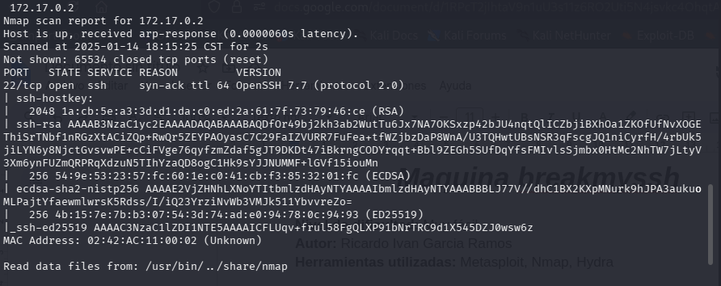
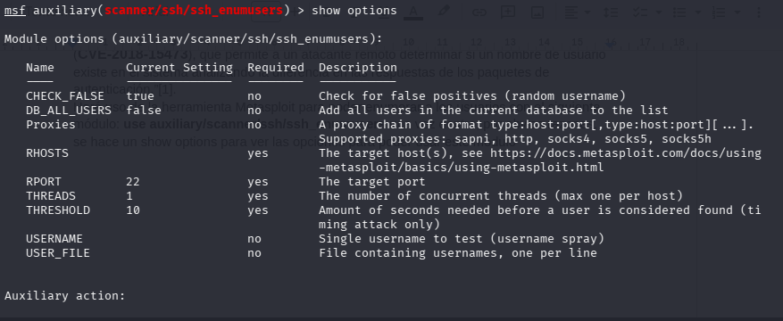
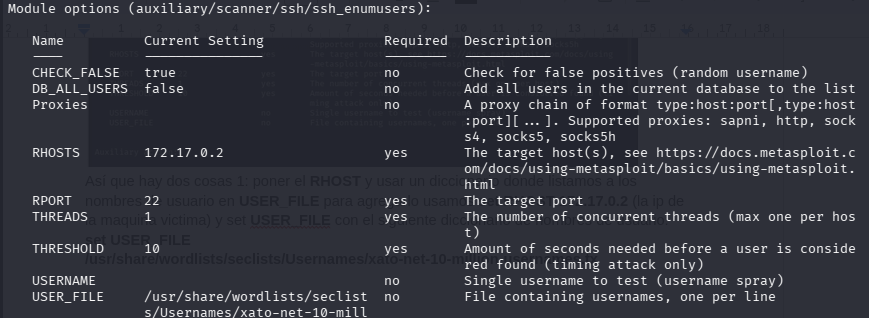
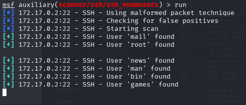
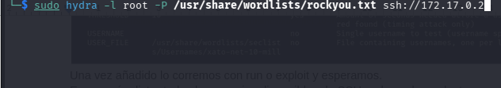
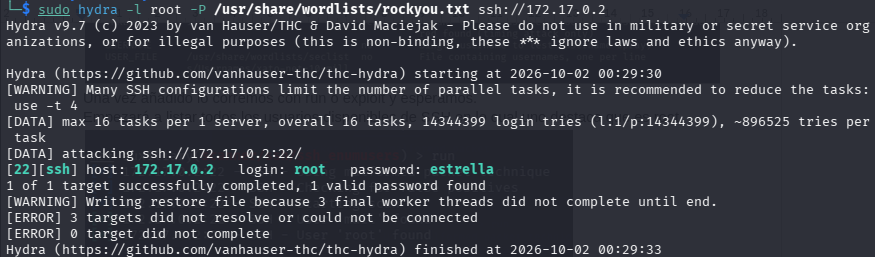
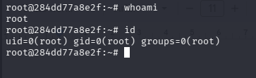

# 🐳 BreakMySSH

> **Plataforma:** DockerLabs  
> **Dificultad:** Muy fácil  
> **Sistema operativo:** Linux  
> **Autor:** Ricardo Ivan Garcia Ramos

---

## 1. Introducción

### Objetivo

El objetivo de esta práctica fue obtener acceso remoto a la máquina mediante el servicio **SSH**.

A diferencia de otras máquinas donde pueden existir varios servicios expuestos, en esta práctica la superficie de ataque identificada estuvo principalmente relacionada con SSH.

### Cadena de explotación

```text
Enumeración de puertos
        ↓
   OpenSSH 7.7
        ↓
 CVE-2018-15473
        ↓
Enumeración de usuarios
        ↓
      root
        ↓
 Ataque de diccionario
        ↓
      Hydra
        ↓
Credenciales de root
        ↓
       SSH
        ↓
      ROOT
```



---

# 2. Reconocimiento

## 2.1 Enumeración inicial

La primera etapa consistió en realizar una enumeración completa de puertos y servicios utilizando **Nmap**.

Se utilizó el siguiente comando:

```bash
nmap -p- -sS -sV -sC -T5 -n -Pn -vvv -oN breakssh 172.17.0.2
```

### Opciones utilizadas

| Opción | Función |
|---|---|
| `-p-` | Escanea todos los puertos TCP |
| `-sS` | Realiza un SYN Scan |
| `-sV` | Intenta identificar las versiones de los servicios |
| `-sC` | Ejecuta los scripts predeterminados de Nmap |
| `-T5` | Utiliza una plantilla de escaneo muy rápida |
| `-n` | Evita la resolución DNS |
| `-Pn` | Trata al objetivo como activo sin realizar descubrimiento mediante ping |
| `-vvv` | Aumenta considerablemente el nivel de detalle de la salida |
| `-oN breakssh` | Guarda el resultado en un archivo de texto |

### Resultado

El escaneo mostró que el puerto **22/TCP** estaba abierto y ejecutaba el servicio **SSH**.

La versión identificada fue:

```text
OpenSSH 7.7
```



---

# 3. Investigación del servicio SSH

Después de identificar la versión de OpenSSH, se investigó si existían vulnerabilidades conocidas relacionadas con esta versión.

Durante la investigación se encontró información relacionada con:

**CVE-2018-15473**

Según la información consultada durante la práctica, esta vulnerabilidad puede permitir la **enumeración de usuarios SSH mediante diferencias en las respuestas durante el proceso de autenticación**.

## ¿Por qué es importante la enumeración de usuarios?

Normalmente, conocer solamente que SSH está abierto no proporciona un nombre de usuario válido.

Si un atacante puede determinar qué nombres de usuario existen, puede reducir considerablemente el espacio de búsqueda para ataques posteriores contra la autenticación.

En esta máquina, la enumeración de usuarios fue utilizada como paso previo para identificar una cuenta privilegiada.

---

# 4. Enumeración de usuarios mediante Metasploit

Para comprobar la posibilidad de enumerar usuarios se utilizó **Metasploit Framework**.

Se seleccionó el módulo:

```text
auxiliary/scanner/ssh/ssh_enumusers
```

Una vez seleccionado el módulo, se ejecutó:

```text
show options
```

Esto permitió revisar las opciones necesarias para configurar el módulo.

Entre ellas se encontraban:

```text
RHOST
USER_FILE
```



---

## 4.1 Configuración del módulo

Primero se indicó la dirección IP de la máquina objetivo:

```text
set RHOST 172.17.0.2
```

Posteriormente se indicó un diccionario con posibles nombres de usuario mediante:

```text
set USER_FILE /usr/share/wordlists/seclists/Usernames/xato-net-10-million-usernames.txt
```

El objetivo del diccionario era proporcionar a Metasploit una lista de nombres que pudiera comprobar contra el servicio SSH.



---

# 5. Ejecución de la enumeración

Una vez configuradas las opciones se ejecutó el módulo mediante:

```text
run
```

o:

```text
exploit
```

El módulo comenzó a comprobar los nombres de usuario proporcionados en el diccionario.

Durante el proceso apareció un usuario especialmente relevante:

```text
root
```

En ese momento se detuvo la enumeración porque ya se había identificado una cuenta con privilegios administrativos.

### Resultado

**Usuario identificado:**

```text
root
```
---

# 6. Ataque de diccionario contra SSH

Con el nombre de usuario `root` identificado, el siguiente objetivo fue determinar si era posible autenticarse mediante SSH.

Para ello se utilizó **Hydra** junto con el diccionario `rockyou.txt`.

La idea de esta etapa fue probar diferentes contraseñas contra el servicio SSH utilizando el usuario previamente identificado.

### Cadena de ataque

```text
Usuario conocido
       ↓
      root
       ↓
     Hydra
       ↓
  rockyou.txt
       ↓
Contraseña válida
```

Durante esta etapa se consiguió recuperar una contraseña válida para la cuenta `root`.



---

# 7. Acceso mediante SSH

Una vez obtenidas las credenciales se realizó una conexión al servicio SSH utilizando el usuario `root`.

La autenticación fue exitosa.

Como resultado se obtuvo una sesión con privilegios administrativos:

```text
root
```

Por lo tanto, se consiguió el objetivo de la máquina.



---

# 8. Cadena completa de explotación

La resolución de **BreakMySSH** puede resumirse de la siguiente manera:

```text
NMAP
  │
  ▼
Puerto 22/TCP
  │
  ▼
OpenSSH 7.7
  │
  ▼
CVE-2018-15473
  │
  ▼
Enumeración de usuarios
  │
  ▼
root
  │
  ▼
HYDRA
  │
  ▼
rockyou.txt
  │
  ▼
Contraseña válida
  │
  ▼
SSH
  │
  ▼
ROOT
```



---

# 9. Herramientas utilizadas

| Herramienta | Uso |
|---|---|
| **Nmap** | Enumeración de puertos, servicios y versiones |
| **Metasploit** | Enumeración de usuarios SSH |
| **Hydra** | Prueba de contraseñas contra SSH |
| **SSH** | Acceso remoto a la máquina |

---

# 10. Vulnerabilidades y técnicas observadas

## 10.1 Enumeración de usuarios SSH

La primera debilidad aprovechada fue la posibilidad de determinar qué usuarios podían existir en el servicio SSH.

Esto permitió pasar de:

```text
"No sé qué usuarios existen"
```

a:

```text
"Existe un usuario llamado root"
```

Esta información facilitó la siguiente etapa del ataque.

---

## 10.2 Ataque de diccionario

Una vez conocido el usuario, se utilizó un diccionario para probar diferentes contraseñas.

En esta máquina, la contraseña pudo ser recuperada mediante `rockyou.txt`.

Esto demuestra la importancia de utilizar contraseñas que no sean fácilmente encontrables mediante ataques basados en diccionarios.

---

## 10.3 Acceso directo de root mediante SSH

Una vez obtenidas las credenciales, fue posible autenticarse directamente como `root`.

Esto representa un problema importante de configuración porque una cuenta con privilegios administrativos estaba disponible para autenticación remota.

---

# 11. Conceptos aprendidos

Esta máquina permite practicar principalmente tres conceptos:

### Enumeración

Antes de intentar explotar un servicio es importante identificar:

- Puertos abiertos.
- Servicios.
- Versiones.
- Posibles vulnerabilidades asociadas.

### Enumeración de usuarios

No solamente es importante saber que un servicio existe. También puede ser relevante descubrir información sobre las cuentas que pueden utilizar dicho servicio.

En este caso:

```text
SSH
 ↓
Enumeración
 ↓
root
```

### Ataques contra autenticación

Una vez obtenido un nombre de usuario válido, un atacante puede intentar determinar su contraseña.

Por eso es importante utilizar:

- Contraseñas robustas.
- Controles contra intentos repetidos.
- Métodos de autenticación más seguros.
- Restricciones sobre las cuentas que pueden conectarse remotamente.

---

# 12. Mitigaciones

La práctica también permite identificar varias medidas defensivas.

## Actualizar OpenSSH

Mantener el servicio SSH actualizado ayuda a evitar vulnerabilidades conocidas.

## Evitar acceso SSH directo de root

Cuando no sea necesario, debería deshabilitarse la autenticación directa del usuario `root` mediante SSH.

## Utilizar contraseñas robustas

Las contraseñas débiles pueden ser recuperadas mediante ataques de diccionario.

## Limitar intentos de autenticación

Se pueden implementar mecanismos para dificultar ataques automatizados contra SSH.

## Utilizar autenticación mediante claves

La autenticación basada en claves SSH puede reducir la dependencia de contraseñas.

---

# 13. Lecciones aprendidas

Esta máquina muestra una situación interesante:

> Una vulnerabilidad aparentemente limitada como la enumeración de usuarios puede convertirse en una parte importante de una cadena de ataque.

El proceso fue:

```text
Información sobre el servicio
          ↓
Enumeración de usuarios
          ↓
Usuario privilegiado
          ↓
Ataque contra autenticación
          ↓
Credenciales válidas
          ↓
Acceso administrativo
```

Por lo tanto, una vulnerabilidad no siempre tiene que proporcionar directamente acceso al sistema para ser útil durante una explotación.

La información obtenida en una etapa puede utilizarse para facilitar la siguiente.

---

# 14. Referencias

Las referencias concretas consultadas durante la práctica no se encuentran detalladas en el documento original.

Como parte de futuras documentaciones, se recomienda registrar aquí las fuentes utilizadas para investigar:

- Vulnerabilidades/CVE.
- Documentación oficial.
- Manuales de las herramientas.
- Artículos técnicos.
- Recursos de aprendizaje.

---

# 15. Conclusión

La máquina **BreakMySSH** permite practicar una cadena de ataque centrada completamente en el servicio SSH.

El proceso comenzó con la enumeración mediante **Nmap**, donde se identificó el puerto 22 y la versión de OpenSSH. Posteriormente se investigó la posibilidad de enumerar usuarios y se utilizó **Metasploit** para comprobar los nombres de usuario disponibles.

La enumeración permitió identificar la cuenta `root`. Posteriormente se utilizó **Hydra** junto con `rockyou.txt` para probar contraseñas contra SSH.

Finalmente, las credenciales obtenidas permitieron iniciar sesión mediante SSH como `root`, completando la explotación de la máquina.

La principal lección de esta práctica fue comprender cómo la enumeración puede proporcionar información que facilita las etapas posteriores de una explotación, incluso cuando la primera vulnerabilidad encontrada no proporciona directamente acceso al sistema.
